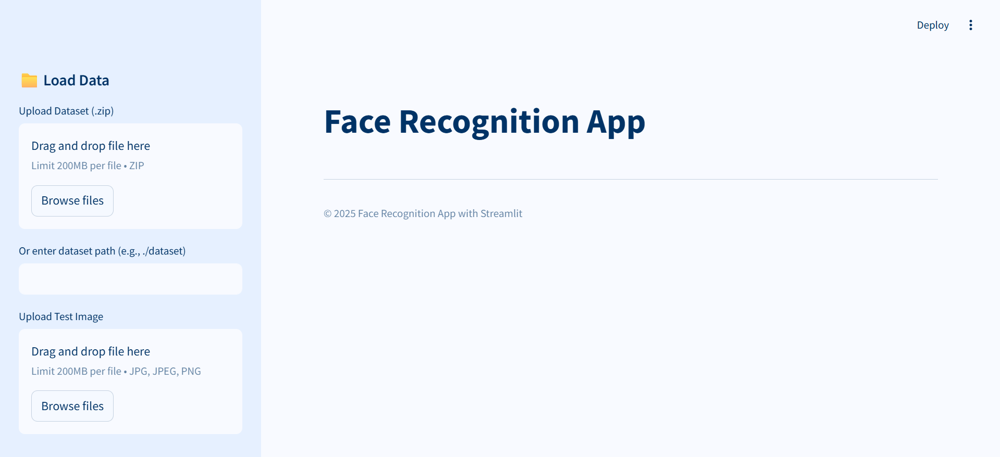

# Aplikasi Nilai Eigen dan Eigenface pada Pengenalan Wajah
Project Based Learning 1 Aljabar Linear 2025  
<br/>

## Table of Contents
* [General Info](#general-information)
* [Tampilan Program](#tampilan-program)
* [How To Run](#how-to-run)
* [Tech Stack](#tech-stack)
* [Project Structure](#project-structure)
* [Credits](#credits)

## General Information
Pengenalan wajah (Face Recognition) adalah teknologi biometrik yang dapat digunakan untuk mengidentifikasi wajah seseorang untuk berbagai kepentingan, khususnya keamanan. Program pengenalan wajah melibatkan kumpulan citra wajah yang sudah disimpan pada database. Berdasarkan kumpulan citra tersebut, program dapat mempelajari bentuk wajah dan mencocokkannya dengan citra baru yang ingin diidentifikasi.

Terdapat berbagai teknik untuk memeriksa citra wajah, seperti jarak Euclidean, cosine similarity, principal component analysis (PCA), serta Eigenface. Pada tugas ini, akan dibuat sebuah program pengenalan wajah menggunakan metode Eigenface.

## Tampilan Program


## How To Run
1. Pastikan semua dependencies sudah terinstall:
```bash
pip install numpy opencv-python streamlit pillow
```

2. Pindah ke direktori `src`:
```bash
cd src
```

3. Jalankan program menggunakan Streamlit:
```bash
streamlit run app.py
```

4. Buka link localhost yang muncul di terminal.

## Tech Stack

### Programming Language
- Python 3.13.0

### Libraries
- OpenCV
- NumPy
- Streamlit
- Pillow (PIL)

## Project Structure
```bash
FACE RECOGNITION/
├── 📁 doc/
│   └── README.md
├── 📁 src/
│   ├── 📁 __pycache__/
│   ├── 📁 .streamlit/
│   ├── 📁 assets/
│   ├── 🐍 app.py
│   ├── 🐍 eigenface.py
│   └── 🐍 main.py
├── 📁 test/
│   ├── Chris Pratt14_759.jpg
│   ├── Chris Pratt206_806.jpg
│   └── Chris Pratt206_809.jpg
└── 📄 requirements.txt
```

## Credits
- Firizqi Aditya Mulya (L0124016)
- Zendinan Okbah Hasan (L0124126)
- Muhammad Daffa Ade N.(L0124127)
